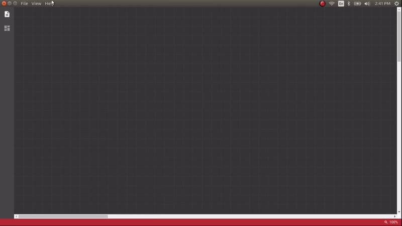

<<<<<<< HEAD
# Schemator Laravel

Schemator Plugin used to work on **Laravel** scheme and export to **model and migration**.

## Field Types

- Big Integer
- Binary
- Boolean
- Char
- Date
- Date Time
- Date Time TZ
- Decimal
- Double
- Enum
- Float
- Integer
- IP Address
- JSON
- JSONB
- Long Text
- MAC Address
- Medium Integer
- Medium Text
- Morphs
- Nullable Morphs
- Small Integer
- String
- Text
- Time
- Tiny Integer
- Timestamp
- Unsigned Big Integer
- Unsigned Integer
- Unsigned Medium Integer
- Unsigned Small Integer
- Unsigned Tiny Integer
- UUID

## Credit

Created by [Gattigaga Hayyuta Dewa](https://github.com/gattigaga).
=======
# Schemator

**Schemator 2 is Electron app, not Chrome app anymore.**

Even figure out to fast prototyping Laravel model and migration in one screen instead of create that stuff one by one ?

With Schemator, you can prototype and visualize your own scheme and export to whatever text files format, not just [Laravel model and migration](https://github.com/gattigaga/schemator-laravel).

Schemator is pluggable, so you can create your own plugin to define your field types, how Schemator create relations between tables, and what data should be exported.

## Contributing

I am sorry, currently I can't accept any code contributions.

## Report

You can create an issue if there is a bug in it.

## License

Created by [Gattigaga Hayyuta Dewa](https://github.com/gattigaga).

License under [MIT](https://github.com/gattigaga/schemator/blob/master/LICENSE) License.
>>>>>>> d9f9d09e7fdb7bdf20920473419f58513fe681a4
